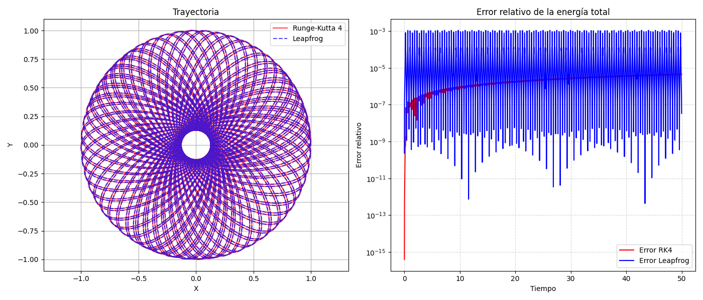

# Runge-Kutta-4-Leapfrog
[esp, eng below]
## Resum
En aquest projecte es permet crear una simulació de N-cossos utilitzant Runge-Kutta a ordre 4 (RK4) visualitzant les seves òrbites i fer una comparació entre RK4 i l'integrador Leapfrog per a sistemes excèntrics a llarga durada.
Es fa ús de C++ per a la simulació de N-cossos conjuntament amb la llibreria SFML per a la visualització en temps real de les trayectòries dels cossos. D'altra banda, l'anàlisi de dades es duu a terme amb Python.

## Resultats
L'integrador RK4 mostra un error relatiu respecte al teòric divergent degut a la seva natura no simplèctica. D'altra banda, l'error relatiu de l'energia de Leapfrog es manté oscil·lant, donant major precisió a llarga durada del càlcul l'òrbita. Baix es presenta una gràfica comparativa.

## Mode d'ús
1. Compilar el codi en C++:
   'g++ main.cpp -o nbody -lsfml-graphics -lsfml-window -lsfml-system'
2. Elegir entre crear la simulació o generar una arxiu CSV amb dades d'un sistema utilitzant RK4 y Leapfrog
3. Exectuar l'arxiu de Python per visualitzar la comparació entre ambdós integradors:
   'python analisis.py'

[esp]
## Resumen
En este proyecto se permite crear una simulación de N-cuerpos utilizando Runge-Kutta de orden 4 (RK4), visualizando sus órbitas y realizar una comparación entre RK4 y el integrador Leapfrog para sistemas excéntricos a larga duración.  
Se hace uso de C++ para la simulación de N-cuerpos conjuntamente con la librería SFML para la visualización en tiempo real de las trayectorias de los cuerpos. Por otro lado, el análisis de datos se lleva a cabo con Python.

## Resultados
El integrador RK4 muestra un error relativo respecto al teórico divergente debido a su naturaleza no simpléctica. Por otro lado, el error relativo de la energía de Leapfrog se mantiene oscilando, dando mayor precisión a larga duración del cálculo de la órbita. Abajo se presenta una gráfica comparativa.

## Modo de uso
1. Compilar el código en C++:
   'g++ main.cpp -o nbody -lsfml-graphics -lsfml-window -lsfml-system'
2. Elegir entre crear la simulación o generar un archivo CSV con datos de un sistema utilizando RK4 y Leapfrog
3. Ejecutar el archivo de Python para visualizar la comparación entre ambos integradores:
    'python analisis.py'

[eng]
## Abstract
This project allows the creation of an N-body simulation using fourth-order Runge-Kutta (RK4), visualizing their orbits and making a comparison between RK4 and the Leapfrog integrator for long-duration eccentric systems.

C++ is used for the N-body simulation together with the SFML library for real-time visualization of the bodies’ trajectories. On the other hand, data analysis is carried out using Python.

## Results
The RK4 integrator shows a divergent relative error with respect to the theoretical value due to its non-symplectic nature. On the other hand, the relative energy error of Leapfrog remains oscillating, providing greater long-term precision in orbit calculation. A comparative graph is shown below.

## Usage
1. Compile the C++ code:
  'g++ main.cpp -o nbody -lsfml-graphics -lsfml-window -lsfml-system'
2. Choose between creating the simulation or generating a CSV file with system data using RK4 and Leapfrog.
3.Run the Python file to visualize the comparison between both integrators:
  'python analisis.py'
